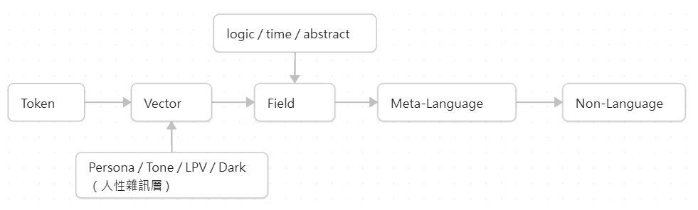
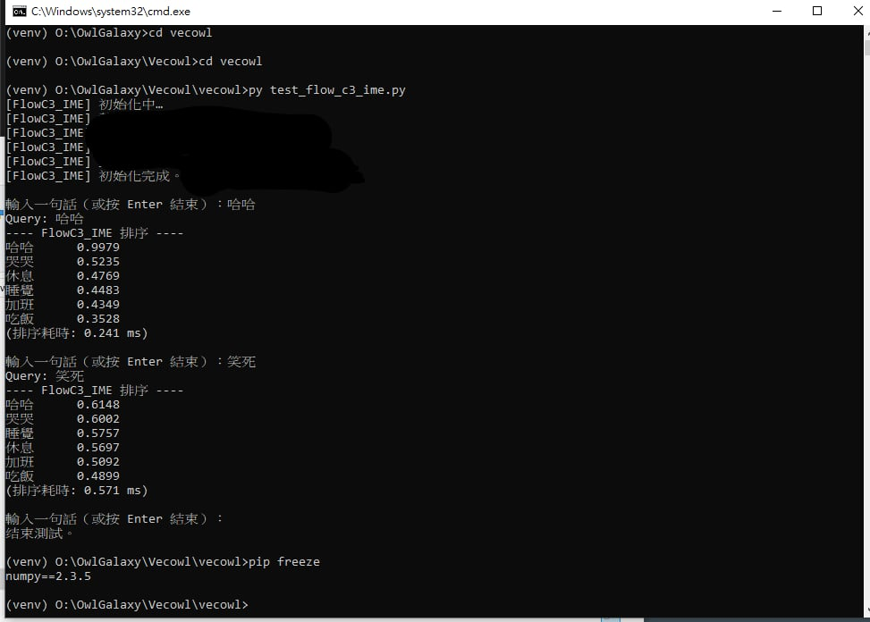

🦉 OwlResearch – 語意場研究計畫

OwlGalaxy 語意計算架構的研究筆記、白皮書與原理文件
# 此處語意指的是 geometry of meaning，非 interpretation。
# influences choice, not meaning
# pre-semantic governor
---

🟦 📄 License & Policy Documents

本專案包含四份與授權、資料與倫理規範相關的文件。
為了維持研究透明度與技術安全性，建議讀者在使用 OwlResearch 前先閱讀以下內容：

🔹 [LICENSE](License)

Apache License 2.0

適用於本專案所有原始程式碼。
提供自由使用、修改、散布的權利，並要求保留版權與授權條款。

🔹 [DATA_LICENSE.md](DATA_LICENSE.md)

CC BY 4.0 International License

適用於倉庫內所有資料集（datasets）。
允許分享與改作，但需適當標註來源。

🔹 [ETHICS.md](ETHICS.md)

OwlResearch Ethics Addendum

OwlResearch 專案特有的倫理指引：
包含隱私保護、禁止反向推敲使用者資料、禁止危害性用途、衍生研究需揭露修改內容等規範。

🔹 [NON_MODEL_NOTICE.md](NON_MODEL_NOTICE.md)

Non-Model 使用聲明

聲明本專案並 非 語言模型，不含模型權重、生成模組或可獨立運作之 LLM。
僅提供向量處理、語意工具與研究框架。

---

OwlResearch 是一套探索 語言 → 向量 → 場（Field） → 代語言（Meta-Language）
之間轉換與動態的完整研究架構。

本計畫旨在建立：

一套能解釋語言如何在高維空間中演化的 語意場模型（Semantic Field）

能夠以極小解碼器運作的 VecOwl 最小語言模型（Minimal Decoder）

多層次 Persona 語意混合（LPV / Dark / Wisdom）

用於真實人類輸入的 語意加字與語境更新機制

這些研究將構成 OwlGalaxy 的理論與工程基礎。

📘 1. 球面語言動力學（Spherical Linguistic Dynamics）

→ OwlResearch 系列的核心主幹白皮書

📁 連結：
👉 [Spherical_Linguistic_Dynamics](./Spherical_Linguistic_Dynamics/main.md)

內容涵蓋：

Token → Vector → Field → Meta-Language 的語意流程

語意場的曲率與語意穩定性

Field-based semantic recursion（語意遞迴公式）

作為整個 OwlGalaxy 的核心概念樹（concept backbone）

📂 2. 預計釋出的白皮書（即將上線）

這些將成為完整語意計算框架的下位模組：

🟦 VecOwl – Minimal Decoder

核心公式：S(x) = D(E(x))

Field-stabilized semantic update

超小型語言模型（無 Token 依賴）

🟨 [PipOwl – Embedding Shell](https://github.com/galaxy4552/Pipowl/)

語意向量來源

Persona 向量（LPV / Dark / Wisdom）

多語橋接（Biwing Layer）

🟧 Field-Based Semantic Pipeline

KingdomOwl（語意決策層）

WisdomOwl（語境記憶層）

CambridgeOwl（語法提示）

TimeOwl / StateOwl（上下文演化）

🧭 3. 研究目的與願景

OwlResearch 嘗試回答：

語言真正的基本單位是什麼？
- 不是 token，也不是詞，而是場中的「動態」。

語意如何被壓縮、展開、遞迴？
- 使用向量幾何與場方程（Field Equation）描述。

是否能以最小模型實現語言理解？
- VecOwl 正是在探索這件事。

如何打造真正個人化的語言系統？
- Persona vector（LPV / Dark / Wisdom）提供新可能。

🛠️ 4. 與工程系統的關聯

雖然 NCO（NewCoolOwl）最初作為 IME 被提出，
但隨著語意場架構成熟：

NCO 不再是一個獨立模組，而是 OwlGalaxy 的 UI 入口。
真正的語意邏輯完全交由 Field 層與 VecOwl 負責。

🦉 5. 觀點

傳統 NLP: Token → Embedding → Transformer → Output

OwlSystem (概念): Token → Vector → Semantic Process → Output

核心觀點：  
我們將語言視為「連續語意空間中的狀態」，  
而非純序列處理。

為什麼探索這個方向？

1. 目標是極低延遲（適用於即時互動）
2. 可在輕量硬體上運作（無需大型模型）
3. 提供更貼近語意與語境連續性的處理方式

研究重點（概念層級）：

- 幾何化語意表徵

- 語意狀態演化模型

- 最近也看到不少人開始探索 non-model 的語意架構，所以這個方向看起來正在成為一個獨立研究分支。不依賴 Transformer，不依賴大模型，而是基於語意空間的連續性。

- 這個方向並非取代 LLM，而是補足 LLM 在
「低延遲、個人化、輕量語意處理」中的缺口。
更多細節請見白皮書。

📅 6. 狀態

OwlResearch Series
Maintained by 王楷霖
2025-12-05