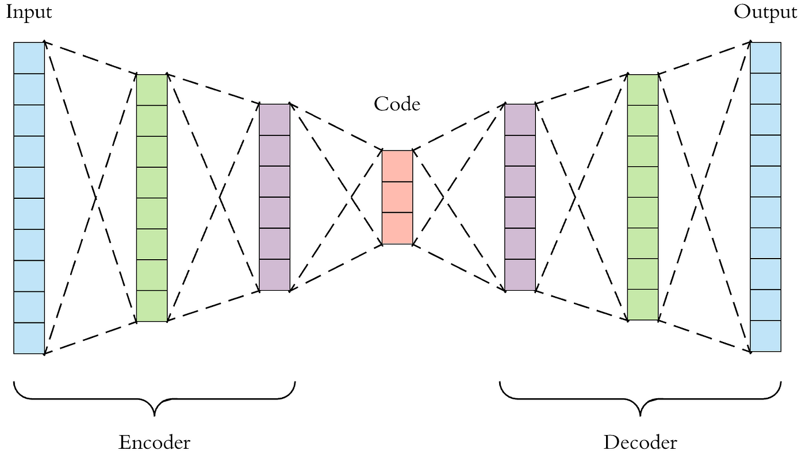
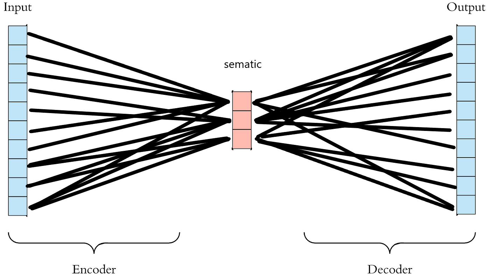
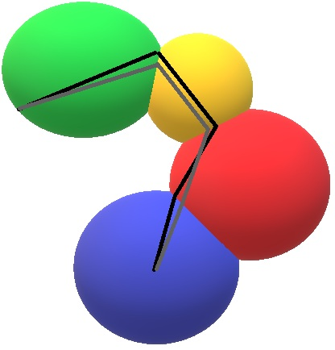
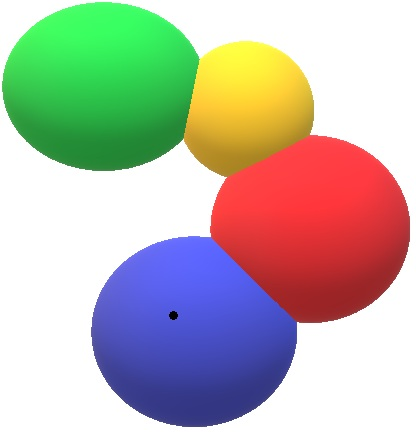

### 傳統LLM:

---

### 軌跡:

---

### 球面理論:

---

（以下黑點皆表示：semantic state 無法穩定投影到語言表示空間）

---

### 幻覺:
球外的一點

黑點=hallucination 沒有語言表示區 
例:給一個詞同時涵蓋文字 數學 哲學領域 
(人類:關我屁事 >直接跳到文字場)

幻覺不是亂講，而是語意狀態被強迫投影到不存在的語言區。

---

### 不生成:
球面上的一點

黑點=fail-gen 無法正常表示區
例:ε=無窮小
世界A 2=1.9999...
世界B 2-ε=1.9999...

不生成不是不知道，而是語言表示無法區分語意狀態。

---

### 語意能量不足:
點被困死在球內

線=球內黑點的軌跡

---

以上現象並非彼此獨立的 LLM 缺陷，
而是同一語意幾何系統在不同邊界條件下的表現。

---